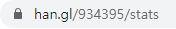

<div align="center">

# han.gl clicks to SVG api

<p align="center">
  
</p>

By_0w0i0n0g0

<br>
<br>

## Table of Contents

[Notification](#notification)

[How to use](#how-to-use)

[Usage](#usage)

[Caution](#caution)

[Etc](#etc)

</div>

<br>
<br>

## Notification

- This API returns the click count state of the link shortener "han.gl" in the form of SVG.

- If you want to use link shortener and use this api, go to : https://han.gl/

- The codes of this repos follow the No License. The code cannot be modified and used for commercial purposes without the copyright holder's permission. For more information, visit : https://choosealicense.com/no-permission/

<br>
<br>

## How to use

---

1. Go to the site where you check the statistics by attaching + to the shortcut link that you made with han.gl.
    - ex) If you created https://han.gl/xt1zo, then the statistics link is : https://han.gl/xt1zo+

- And then you will get link like this : https://han.gl/24663/stats

---

2. Then visit : https://hangl-statistics-to-svg.herokuapp.com/makeUrl.php

- And make your SVG link!

<p align="center">
  
</p>

- __PLEASE__ make sure that the link you put in to the SVG url maker should contain https:// or http://.
  - ex) The created SVG url looks like : https://server.com/?url=https://han.gl/xt1zo+
  - NOT : https://server.com/?url=han.gl/xt1zo+

---

<br>
<br>

## Usage
You can use it in README.md or every other site like this :

- ex 1)

```

```


- ex 2)

```
<p align="center">

</p>
```


<p align="center">

</p>


<br>
<br>

## Caution

This api is created for the convenience of service users, without any interaction with han.gl.

<br>
<br>

## Etc

### Roadmap

- [X] Run the demo server.
- [X] Supports for multiple links.
- [X] Run directly with han.gl stats link.
- [X] Provide url Maker for easy use.

<br>

### Version

- v.0
  - Only one link is supported.
  - Can't use it in GitHub README.md because JavaScript is used.

- v.1
  - Multiple links are supported.
  - You can use it in GitHub README.md because now, it is returning the pure svg.

- v.2
  - Now it can get parameters directly with han.gl stats link.
  - Create svg link easily with SVG url maker.
  - If there is no url parameters, it redirects to SVG url maker.